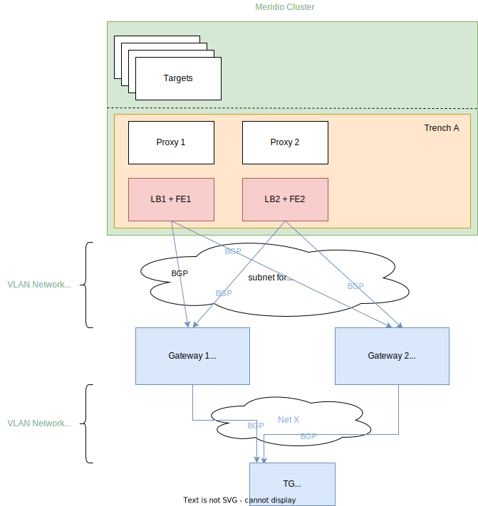

# xcluster based Meridio test cluster

## Installation

Refer to [Meridio description](https://github.com/Nordix/Meridio/blob/master/docs/demo/xcluster.md) for details. 

## Description

Run basic tests on Meridio cluster with two Gateway routers and a Traffic Generator implemented as PODs.  

The described framework is a possible approach, that could be also reused on other deployments lacking elaborate network infrastructure suited for a "real-life" gateway router based test infrastructure.

Since external connectivity is based on VLAN networks in a Meridio cluster, the Gateway router PODs
also require a VLAN interface. Moreover to achieve traffic separation additional VLAN network is used
between the Gateways and TG. These Secondary Networks are provided by multus (including vlan and static cni-plugins) that gets installed by the OVL.



### Taints/Tolerations

The OVL configures the VMs used as routers in xcluster (vm-201, ..., vm-220) to also become part of
the kubernetes cluster.

"Router VMs" get tainted with a key of NoSchedule effect (gw=true:NoSchedule), thus only resources with proper toleration could get scheduled on them.  

The goal is to restrict the Gateway router functionality implemented as kubernetes resources to said VMs. And the main reason for that is to avoid VLAN ID collision between Frontends and Gateways by separating the two. While also reserving nodes for Gateways where Meridio cluster resources can not be deployed to.  

Taints are applied during node registration through kubelet using option "--register-with-taints".
However nodes can be tainted runtime as well using [kubectl](https://kubernetes.io/docs/concepts/scheduling-eviction/taint-and-toleration/#concepts).
```
# taint vm-001, vm-002 using kubectl
kubectl taint nodes vm-201 vm-202 gw=true:NoSchedule
```

Note: multus v3.8 by default tolerates all keys with effect NoSchedule, so there's no need to adjust its config

### POD affinity/anti-affinity

Gateways that belong to the same VLAN network must not end up on the same VM to avoid VLAN ID collision.  
(Similar to how Meridio Frontends of the same Trench are separated.)

This is achieved through k8s labels and [POD antiAffinity](https://kubernetes.io/docs/concepts/scheduling-eviction/assign-pod-node/#inter-pod-affinity-and-anti-affinity).

```
# example Gateway POD anti-affinity
      labels:
        app: gateway
    spec:
      nodeSelector:
        gw: "true"
      tolerations:
      - key: "gw"
        operator: "Exists"
      affinity:
        podAntiAffinity:
          requiredDuringSchedulingIgnoredDuringExecution:
          - labelSelector:
              matchExpressions:
              - key: app
                operator: In
                values:
                - "gateway"
            topologyKey: kubernetes.io/hostname
```

Similarly Gateway and Traffic Generator must be also separated. But since TG lacks toleration they can not get scheduled to the same node.

### Gateway and TG


#### Init containers

Init container sets L4 hashing for the linux kernel based Equal Cost Multipath (ECMP) routing, and in case of the Gateway also enables linux kernel forwarding functionality.

#### Ctraffic container

Makes [ctraffic](https://github.com/Nordix/ctraffic) available in the Traffic Generator to be used as a traffic test tool.

#### BIRD

The core of both the GW and TG functionality is [BIRD](https://bird.network.cz/?get_doc&f=bird.html&v=20).  

A [common docker image](https://github.com/Nordix/Meridio/tree/933b6b56bf872c095cce8018bad3cfa8e7944652/docs/demo/deployments/xcluster/ovl/meridio/gateway) is used containing the necessary BIRD configuration files, and two simple scripts wrapping
BIRD start and allowing some limited configuration options.

##### GW - Frontend
The Gateway has dynamic BGP configuration (IPv4, IPv6) on the interface facing the Frontends, and accepts connections from all IP addresses.
Thus allowing this part of the BGP config to be IP address agnostic (supplementing the protocol's lack of neighbor discovery).  

GW exports default routes to connected Frontend BGP peers, and announces itself as the next-hop. These default routes are not fetched from the OS kernel, but configured as [static protocol routes](https://bird.network.cz/?get_doc&v=20&f=bird-6.html#ss6.14) in the BIRD config and are only exposed to Frontend BGP peers.  

Gateway accepts (imports) VIP routes from Frontends, which will be synced to the OS kernel. ECMP routing is enabled in [kernel protocol](https://bird.network.cz/?get_doc&v=20&f=bird-6.html#ss6.6) settings (see `merge paths on`) to allow installing multipath routes.

##### GW - TG
BGP is also configured between the Gateways and Traffic Generator to support runtime update of VIP related routes towards the TG.  

Gateway initiates a BGP session for both IPv4 and IPv6 towards the pre-configured Traffic Generator IP on its respective interface. And exports VIP routes learnt from Frontend BGP peers to the TG. The TG uses a dynamic BGP setup to accept connections from the Gateways.  

The GW does not accept any routes from TG. That's because the TG is expected to use its IP part of the VLAN network to send/receive traffic.  

The TG enables ECMP routing to allow installing multipath routes in case of multiple Gateways.

#### Secondary Networks

The required Secondary Networks (VLAN) are provided through NetworkAttachementDefinitions with static IPAM.
```
# example NADs used by Gateways
apiVersion: "k8s.cni.cncf.io/v1"
kind: NetworkAttachmentDefinition
metadata:
  name: vlan-conf
spec:
  config: '{
      "cniVersion": "0.3.1",
      "plugins": [
        {
          "type": "vlan",
          "capabilities": { "ips": true },
          "master": "eth1",
          "vlanId": 100,
          "ipam": {
            "type": "static"
          }
        }
      ]
    }'
---
apiVersion: "k8s.cni.cncf.io/v1"
kind: NetworkAttachmentDefinition
metadata:
  name: gwtg-conf
spec:
  config: '{
      "cniVersion": "0.3.1",
      "plugins": [
        {
          "type": "vlan",
          "capabilities": { "ips": true },
          "master": "eth2",
          "vlanId": 3000,
          "ipam": {
            "type": "static"
          }
        }
      ]
    }'
```

The related IP addresses are configured through annotations in the manifest files.

```
# example Gateway network annotation
      annotations:
        k8s.v1.cni.cncf.io/networks: '[
          { "name": "vlan-conf",
            "ips": [ "169.254.100.254/24", "fe80::beef/64", "100:100::254/64" ],
           "interface": "vlan0"
          },
         { "name": "gwtg-conf",
           "ips": [ "11.0.0.1/24", "1111::1/100" ],
           "interface": "tg"
         }]'
```

The interface names are currently hardcoded.
That is in the Gateway **vlan0** serves Frontends, while the interface facing the TG is called **tg**.
Similarly in the Traffic Generator the interface **tg** is used to interact with the Gateways.

Note: Should the interface names change, BIRD configuration or BIRD wrapper scripts must be also updated.

Avoiding IP address collisions between the Gateways and connected Meridio Frontends is outside the scope of this description.
(In Meridio Frontends the network for external connectivity is provided by Network Service Mesh (NSM), which has a feature to reserve certain IP addresses the associated IPAMs are not allowed to assign.)

#### Helm

Deploy two Gateways and a Traffic Generator with [helm](https://github.com/Nordix/Meridio/tree/master/docs/demo/deployments/xcluster/ovl/meridio/helm/gateway).

Some of the parameters the chart allows to configure:
- VLAN ID of the network between Merdio Frontends and Gateways (default=`100`)  
  Note: Must be in sync with the value used by the Meridio Frontends to be connected with.
- VLAN ID of the network between the TG and Gateways (default=`3000`)  
- Host node interfaces to be used as VLAN masters (default=`eth0`)  
  Note: Parameter `masterItf` must match the master interface used by the Meridio Frontends to be connected with.
- Gateway IP addresses to be used on the VLAN interface facing Meridio Frontends  
  (default; gw1IPv4=`169.254.100.254/24`, gw1IPv6_2=`100:100::254/64`, gw2IPv4=`169.254.100.253/24`, gw2IPv6_2=`100:100::253/64`)  
  Note: IPv6 link-local addresses can be also used, moreover they are by default configured (gw1IPv6=`fe80::beef/64`, gw2IPv6=`fe80::beee/64`)
- Gateway IP addresses to be used on the VLAN interface facing the TG  
  (default; gwtg1IPv4=`11.0.0.1/24`, gwtg1IPv6=`1111::1/100`, gwtg2IPv4=`11.0.0.2/24`, gwtg2IPv6=`1111::2/100`)
- TG IP addresses to be used on the VLAN interface facing the Gateways  
  (default; tg1IPv4=`11.0.0.3/24`, tg1IPv6=`1111::3/100`)

```
# example setting the VLAN masters and VLAN IDs 
helm install Meridio/docs/demo/deployments/xcluster/ovl/meridio/helm/gateway --generate-name --set masterItf=eth1,vlanId=100,tgMasterItf=eth2,tgVlanId=3000  --create-namespace --namespace test1
# example using eth1 for both VLAN networks as master interface
helm install Meridio/docs/demo/deployments/xcluster/ovl/meridio/helm/gateway --generate-name --set masterItf=eth1,vlanId=100,tgMasterItf=eth1,tgVlanId=3000  --create-namespace --namespace test1
```

##### Test multiple Trenches

Multiple releases of the helm chart can be deployed. Where each deployment is supposed to serve a different Meridio Trench.

To avoid kubernetes resource name collisions separate k8s namespaces must be used. And the helm parameter `postfix` must be set and must be unique among the releases.

The VLAN IDs must be also changed, however the IP addresses can be re-used (depending on the Frontend configuration).

```
helm install Meridio/docs/demo/deployments/xcluster/ovl/meridio/helm/gateway --generate-name --set masterItf=eth1,vlanId=101,tgMasterItf=eth2,tgVlanId=3001,postfix="second"  --create-namespace --namespace test2
```
