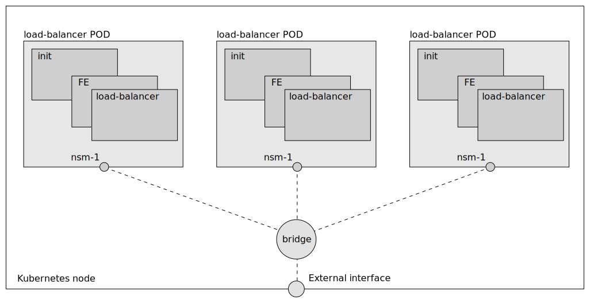
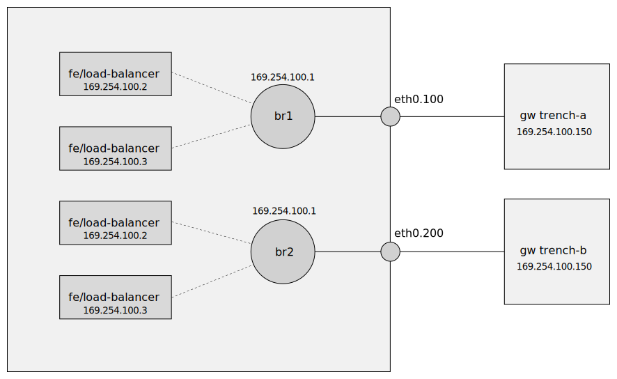

# Multus in Meridio

The Frontend (FE) must have an interface to the external network. The
interface can be created in several ways. In Meridio we use either the
NSM `nse-remote-vlan` service endpoint or [Multus](
https://github.com/k8snetworkplumbingwg/multus-cni).


It is important to note that the FE is unaware of how the interface is
created, it just uses it. If Multus is used the network
service client (nsc) is not needed and is removed from the
load-balancer POD.


## Multiple FEs using the same external network

To connect several FEs to the same external network we can use a Linux
`bridge`.



With Multus this is easily done with the [bridge cni-plugin](
https://www.cni.dev/plugins/current/main/bridge/). The external
interface must be created and attached to the bridge. An example with vlan;

```
ip link add link eth0 name eth0.100 type vlan id 100
echo 0 > /proc/sys/net/ipv6/conf/eth0.100/accept_dad
ip link set up dev eth0.100
ip link set dev eth0.100 master cbr2
```

It doesn't matter if the load-balancer PODs belong to different trenches.


## Multus in e2e test

Setup in KinD;



Prepare a started KinD cluster for e2e test with Multus;
```
./test/e2e/meridio-e2e.sh  # Help printout
./test/e2e/meridio-e2e.sh multus_prepare
```
