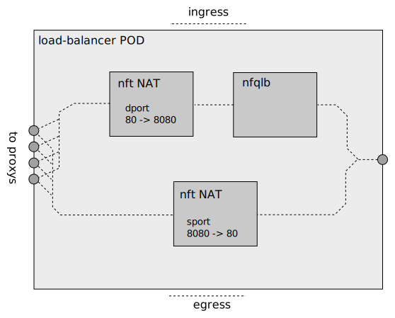

# Meridio - Stateless port-NAT


Stateless port-NAT can be used to map a privileged port, e.g. 80, to
an unprivileged port in the server, e.g. 8080. Port-NAT is enabled
using the `local-port` item in flows.

```yaml
  flows: |
    items:
    - name: port-nat
      vips:
        - vip1
        - vip2
      destination-port-ranges:
        - 80
      protocols:
        - tcp
      stream: stream1
      local-port: 8080
```


## Constraints

* When `local-port` is specified in a flow the `destination-port-ranges` must
  contain only one single port. Multiple ports or port-ranges are not allowed.

* Since stateless NAT is used the `local-port` *must* be unique for
  the VIPs. In the example above it means that no other flow using the
  same VIPs may use local-port=8080. This applies also for non-NAT'ed
  flows, so a non-NAT'ed flow including dport 8080 would be forbidden.

* Port-NAT is applied on VIPs, not flows. So priorities or source
  matching can not be used to select if port-NAT should occur for flows.

* Port-NAT is not supported for UDP encapsulated SCTP.


## Details

Port-NAT is performed after load-lalancing;



Port-NAT is unconditional for all VIPs in the flow. If a non-nat'ed
flow uses the same VIPs and has target port 8080 in the example, the
port *will* be translated to 80 in the return path and communication
will not work.

Port-NAT is implemented by `nft` rules;
```
    chain flow-port-nat {
        type filter hook postrouting priority 100; policy accept;
        ip daddr @flow-port-nat-vips4 tcp dport 80 tcp dport set 8080 counter packets 0 bytes 0 notrack
        ip saddr @flow-port-nat-vips4 tcp sport 8080 tcp sport set 80 counter packets 0 bytes 0 notrack
    }
```

The `100` priority (ChainPriorityNATSource) ensures that NAT comes
after load-balancing.

While flow priorities can't be used to exclude NAT they can be
used if the `local-port` is the same. For instance to create a "fast lane"
based on source address;

```yaml
  flows: |
    items:
    - name: port-nat-fast
      priority: 100
      vips:
        - vip1
        - vip2
      source-subnets:
        - 200.200.200.0/24
        - 2000::/120
      destination-port-ranges:
        - 80
      protocols:
        - tcp
      stream: fast-servers
      local-port: 8080
    - name: port-nat
      priority: 0
      vips:
        - vip1
        - vip2
      destination-port-ranges:
        - 80
      protocols:
        - tcp
      stream: slow-servers
      local-port: 8080
```
