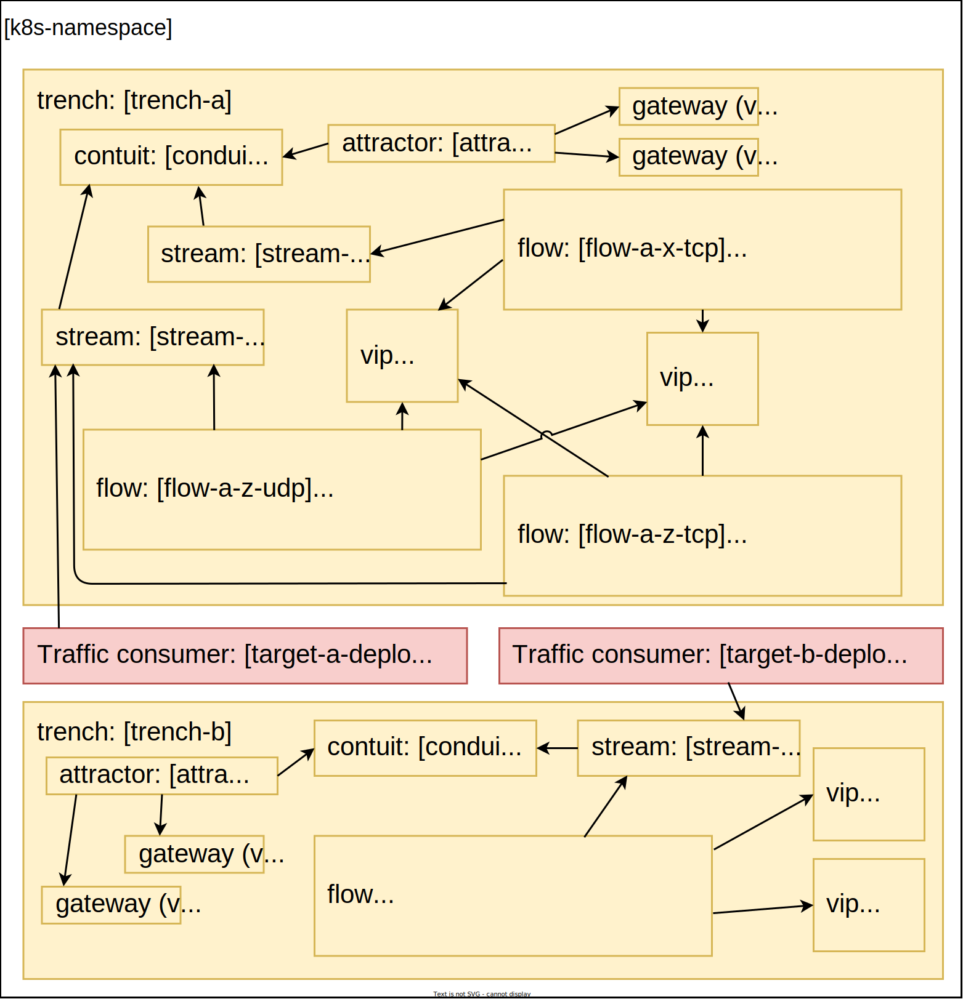

# Test

## E2E Tests

### Environment

#### Initial Deployment



#### Test in another environment

1. Set `TRAFFIC_GENERATOR_CMD` when running `make e2e`
2. Implement `test.sh`

### List of tests

- IngressTraffic (ingress_traffic_test.go)
    - IPv4 TCP traffic (20.0.0.1:4000)
    - IPv4 UDP traffic (20.0.0.1:4003)
    - IPv6 TCP traffic ([2000::1]:4000)
    - IPv6 UDP traffic ([2000::1]:4003)
- MultiTrenches (multi_trenches_test.go)
    - Disconnect a target from trench-a and connect it to trench-b, then test traffic in both trench (and revert the changes)
    - Send traffic in 2 trenches (with the same configuration) at the same time
- Scaling (scaling_test.go)
    - Scale in targets to 3 (and back to 4)
    - Scale in targets to 5 (and back to 4)
- Target (target_test.go)
    - Close a stream, check traffic has not been received by the target and re-open the stream
- Configuration (configuration_test.go)
    - Add a new VIP (60.0.0.150) to stream-a and attractor-a and test traffic and remove it after

### Tools

- ginkgo - https://onsi.github.io/ginkgo/#getting-ginkgo

### Steps (Kind)

1. Deploy Spire

```bash
kubectl apply -k docs/demo/deployments/spire
```

2. Deploy NSM

```bash
helm install docs/demo/deployments/nsm --generate-name --create-namespace --namespace nsm
```

3. Deploy Gateways

```bash
./docs/demo/scripts/kind/external-host.sh
```

4. Deploy trench-a

```bash
helm install deployments/helm/ --generate-name --create-namespace --namespace red --set trench.name=trench-a --set ipFamily=dualstack
```

5. Deploy trench-b

```bash
helm install deployments/helm/ --generate-name --create-namespace --namespace red --set trench.name=trench-b --set vlan.id=200 --set ipFamily=dualstack
```

6. Deploy target of trench-a

```bash
helm install examples/target/helm/ --generate-name --create-namespace --namespace red --set applicationName=target-a --set default.trench.name=trench-a
```

7. Deploy target of trench-b

```bash
helm install examples/target/helm/ --generate-name --create-namespace --namespace red --set applicationName=target-b --set default.trench.name=trench-b
```

8. Run e2e tests

```bash
make e2e
```
