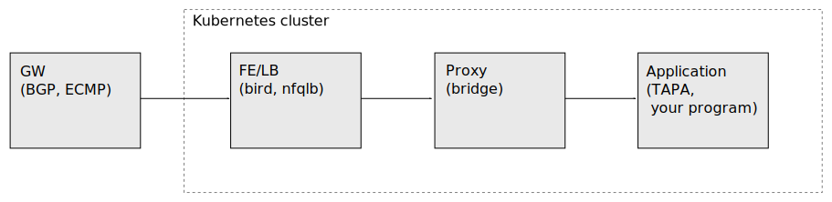

# Meridio - Troubleshooting Guide

This guide focuses on `Meridio`, the Operator is only briefly touched.

To be able to troubleshoot *anything* you must know how it works when
everything is OK. So try to follow this guide, check the logs and use
the tools in a healthy (test) system first.

We will often follow the traffic-path. In each POD in the path traffic can
be traced, for instance with `tcpdump`. Normal Linux tools like `ip`
can be used to check interfaces, addresses and routes. The state of
some programs, e.g. [bird](https://bird.network.cz/) and
[nfqlb](https://github.com/Nordix/nfqueue-loadbalancer/), can also be
checked.




## PODs

If something doesn't work a good starting point is to check the health
of all PODs.  Beside the `Meridio` PODs the
[NSM](https://networkservicemesh.io/) and [Spire](https://spiffe.io/)
PODs must work.

Please also check the [diagram in the overview](
https://github.com/Nordix/Meridio/blob/documentation/docs/overview.md#diagrams).

### The Meridio PODs

The Meridio PODs belong to a "trench". From troubleshooting POV this
can be translated to a K8s `namespace`. `Meridio` allows application
PODs in other namespaces, but that is not common so in this guide we
assume that the application PODs are also in the trench namespace.

```
# kubectl get pods -n red
NAME                                    READY   STATUS    RESTARTS   AGE
meridio-app-74f796dd77-6hpmn            2/2     Running   0          50s
meridio-app-74f796dd77-js9wl            2/2     Running   0          51s
meridio-app-74f796dd77-mcwpv            2/2     Running   0          50s
meridio-app-74f796dd77-wsppz            2/2     Running   0          50s
meridio-ipam-0                          1/1     Running   0          103s
meridio-load-balancer-5785674d6-46qjc   3/3     Running   0          102s
meridio-load-balancer-5785674d6-rqn2n   3/3     Running   0          102s
meridio-nse-8dbb46ff8-wlnrm             1/1     Running   0          103s
meridio-nsp-0                           1/1     Running   0          103s
meridio-proxy-5slff                     1/1     Running   0          102s
meridio-proxy-q6n5n                     1/1     Running   0          102s
meridio-proxy-v4hqk                     1/1     Running   0          102s
```

In this example the trench namespace is "red". The pod names may be
different but the `load-balancer` and `proxy` should be possible to
identify. Also shown are the Meridio PODs *not* in the traffic path,
the "NSP" which can be seen as a central registry, "IPAM" that
hands out IP addresses and "NSE" which is the NSM "endpoint".

All PODs must be "Running" and all containers ready, like 3/3 for the
load-balancer. And preferably no restarts.

#### The load-balancer does not become ready

```
# kubectl get pods -n red
NAME                                     READY   STATUS    RESTARTS   AGE
meridio-ipam-0                           1/1     Running   0          2m6s
meridio-load-balancer-7575c6d667-k9tbj   1/3     Running   0          2m5s
meridio-load-balancer-7575c6d667-r6slj   1/3     Running   0          2m5s
...
```

The `load-balancer` will not become "ready" until the `fe` has contact
with the external GW. A probable reason is a failed BGP or BFD
session. In this case you should proceed to check the `bird` router in
the `fe` container (see below).


### The NSM and Spire pods

These are not really a part of `Meridio` and may be started in
different ways on different systems. They are however vital for the
function.

```
# kubectl get pods -A
NAMESPACE            NAME                                      READY   STATUS    RESTARTS   AGE
default              forwarder-vpp-7rf6t                       1/1     Running   0          2m40s
default              forwarder-vpp-mz6xd                       1/1     Running   0          2m40s
default              forwarder-vpp-xx4xk                       1/1     Running   0          2m40s
default              nsmgr-9zvn7                               2/2     Running   0          2m51s
default              nsmgr-m8bzm                               2/2     Running   0          2m51s
default              nsmgr-r8r8q                               2/2     Running   0          2m51s
default              registry-k8s-774648b57b-ppxw8             1/1     Running   0          2m51s
spire                spire-agent-hgzb2                         1/1     Running   0          3m25s
spire                spire-agent-rp4g2                         1/1     Running   0          3m25s
spire                spire-agent-zbqls                         1/1     Running   0          3m25s
spire                spire-server-0                            2/2     Running   0          3m24s
```

The NSM PODs in this example are in the `default` namespace but are
usually in another e.g. "NSM".


## Logs

Logs are fundamental for troubleshooting but you must know what to
look for. So it is important to check logs in a healthy system quite
closely, what is logged on setup for instance. Check logs with;

```
# kubectl logs -n red -c load-balancer meridio-load-balancer-5785674d6-46qjc | jq
...
```

For PODs with multiple containers you must specify the container with
the `-c` option.

Meridio uses [structured logging](../logging.md) so logs are printed
in `json` format. The [jq](https://stedolan.github.io/jq/) program can
be used for formatting and filter. NSM [cannot be configured](
https://github.com/networkservicemesh/sdk/pull/1348) for structured
logging so unformatted log records may still be emitted.


### Log levels

True to the concepts of [logr](https://github.com/go-logr/logr) you
can only set `DEBUG` and `TRACE` levels.  The log level for a
container is specified with an environment variable in the
manifest. Example;

```
          env:
            - name: NSM_LOG_LEVEL
              value: "DEBUG"

```

This method can be used for both Meridio and NSM containers. The log
level can not be changed without a POD restart.


## Enter containers

To check things inside a container you use `kubectl exec`. Examples;

```
kubectl exec -n red meridio-proxy-96nvc -- ifconfig
# Or
kubectl exec -it -n red meridio-load-balancer-5785674d6-4hqsh -c load-balancer -- sh
```

We will give examples on how to troubleshoot individual Meridio
containers below.


### Ephemeral containers

Tools necessary for debugging, like `tcpdump`, may not be available in
the Meridio PODs for security reasons. In the future "distroless"
containers may be used that don't even have a shell.

In these cases we can add an [ephemeral
container](https://kubernetes.io/docs/concepts/workloads/pods/ephemeral-containers/)
with the necessary tools. Ephemeral containers is "beta" in K8s 1.23
but require the feature-gate `EphemeralContainers=true` in earlier versions.

```
ns=red
pod=meridio-load-balancer-5785674d6-w9jxd
kubectl debug --container meridio-debug --image registry.nordix.org/cloud-native/meridio/debug:latest -n $ns $pod -it -- sh
```

Here the Meridio debug container is used, but you may use any
image. To simplify reconnection you should specify a name with
`--container` (or `-c`).

#### Ephemeral containers can *not* be unloaded and are *never* restarted.

This means that if you `exit` the shell you create a "zombie"
container. It is dead but will still linger around. Instead use the
escape sequence `ctrl-p/ctrl-q` to disconnect from an Ephemeral
container. Then you can reconnect later with;

```
ns=red
pod=meridio-load-balancer-5785674d6-557hj
kubectl attach -n $ns $pod -c meridio-debug -it
```

#### Shared Process Namespace

By default all containers in the POD have their own Process
Namespace. So in the ephemeral containers you see only your own process;
```
/ # ps www
PID   USER     TIME  COMMAND
    1 root      0:00 sh
    8 root      0:00 ps www
```

You probably want to see all processes in the POD, for instance to use
`strace`. In the manifest add;

```
    spec:
      shareProcessNamespace: true
```

Now you can see all processes in the POD;

```
/ # ps www
PID   USER     TIME  COMMAND
    1 root      0:00 /pause
   15 root      0:00 ./load-balancer
   28 root      0:00 /bin/app
   38 root      0:00 ./frontend
   52 root      0:00 nfqlb flowlb --promiscuous_ping --queue=0:3 --qlength=1024
   67 root      0:00 bird -d -c /etc/bird/bird-fe-meridio.conf
  697 root      0:00 sh
  719 root      0:00 ps www
```

Unfortunely `strace` is not permitted without
[SYS_PTRACE](https://github.com/kubernetes/kubernetes/issues/97103)
which can't be granted without
[debugging profiles](https://github.com/kubernetes/enhancements/tree/master/keps/sig-cli/1441-kubectl-debug#debugging-profiles).


#### Privileges

For now ephemeral containers inherit the privileges from the POD. In the future
[debugging profiles](https://github.com/kubernetes/enhancements/tree/master/keps/sig-cli/1441-kubectl-debug#debugging-profiles)
will allow the ephemeral containers to control their privileges
([track](https://github.com/kubernetes/enhancements/issues/1441)).
In Meridio we may need `netadmin`.

A privileged ephemeral container can be loaded by accessing the [api
server directly](https://nieldw.medium.com/curling-the-kubernetes-api-server-d7675cfc398c);

```
ns=red
APISERVER=https://192.168.1.1:6443
TOKEN=kallekula
curl --insecure -s $APISERVER/api/v1/namespaces/$ns/pods/ \
 --header "Authorization: Bearer $TOKEN" | jq -rM '.items[].metadata.name'
pod=...(from above)

curl -v --insecure -XPATCH --header "Authorization: Bearer $TOKEN" \
 -H "Content-Type: application/json-patch+json" \
 $APISERVER/api/v1/namespaces/$ns/pods/$pod/ephemeralcontainers \
 --data-binary @- << EOF
[{
 "op": "add", "path": "/spec/ephemeralContainers/-",
 "value": {
  "command":[ "/bin/sh" ],
  "stdin": true, "tty": true,
  "image": "registry.nordix.org/cloud-native/meridio/debug:latest",
  "name": "debug-container-2",
  "securityContext": { "privileged": true }
 }}]
EOF
kubectl attach -n $ns $pod -c debug-container-2 -it
```

This only works when there is an ephemeral container. So create one
with `kubectl debug` first. (if you know another way, please write an issue).


#### Automatic troubleshooting

The most obvious way is to use ephemeral containers for interactive
debugging but ephemeral containers can do more. You can write
automatic analyze tools and inject ephemeral containers in several Meridio PODs.


## LB/FE

The "LB/FE" POD is the most complex and probably the first to
check. It contains two important components;

* Frontend (FE) - containing the router daemon
  ([bird](https://bird.network.cz/)) that attracts traffic

* Loadbalancer (LB) - The loadbalancer
  ([nfqlb](https://github.com/Nordix/nfqueue-loadbalancer/)) that
  distributes traffic between targets (application PODs)

If the `load-balancer` POD doesn't become ready a likely cause is that
the `fe` has failed to establish a session with the external GW.


### Interfaces and tcpdump

It is always good to check that all expected interfaces exist, are
"up" and have addresses.

```
kubectl exec -n red meridio-load-balancer-5785674d6-4hqsh -c fe -- ifconfig
```

Interfaces to look for are;

* eth0 - the Kubernetes "main" interface

* nsm-1 - (or similar) this is the interface where external traffic
  enters. Usually a VLAN interface on the external network.

* load-balan-* - these are interfaces towards the "proxy" PODs. There
  should be as many as you have proxies in the trench.

All these interfaces must be "up" and have valid addresses, both IPv4
and IPv6.

If no traffic works a good place to start is to check that traffic
really enters the system.

```
kubectl exec -it -n red meridio-load-balancer-5785674d6-4hqsh -c fe -- sh
tcpdump -ni nsm-1
```

We use `tcpdump` to trace traffic on the external interface.


### Bird

The [bird](https://bird.network.cz/) routing suite runs in the `fe`
container.

A "normal" problem (i.e. not a bug) is that the `fe` fails to
establish a session with the external GW.

```
# kubectl exec -n red meridio-load-balancer-7575c6d667-k9tbj -c fe -- b
irdcl show protocols all
BIRD 2.0.8 ready.
Name       Proto      Table      State  Since         Info
device1    Device     ---        up     06:07:35.951  
...
  Channel ipv6
    State:          DOWN
```

The state is "DOWN" which indicates a problem. The cause is probably a
misconfiguration in the `Meridio` "attractor" and/or "gateways" or in
the external GW. Troubleshooting must be done on "both sides", Meridio
and the GW-router (some HW router or an SDN).


### Nfqlb

The [nfqlb](https://github.com/Nordix/nfqueue-loadbalancer/)
loadbalancer runs in the `load-balancer` container. Please check the
`nfqlb` documentation, it will help to understand the function and
thus to troubleshoot.

First check the "flows";

```
kubectl exec -n red meridio-load-balancer-5785674d6-6cqhm -c load-balancer -- nfqlb flow-list
[{
  "name": "tshm-stream1-flow1",
  "priority": 0,
  "protocols": [ "tcp" ],
  "dests": [
    "::ffff:10.0.0.1/128",
    "1000::1:a00:1/128"
  ],
  "dports": [
    "5000-5003"
  ],
  "matches_count": 540,
  "user_ref": "tshm-stream1"
}]
```

This should match your Meridio "flows".

Next to check is the targets which should be all applications in your
Meridio "stream";

```
kubectl exec -n red meridio-load-balancer-5785674d6-6cqhm -c load-balancer -- nfqlb show --shm=tshm-stream1
Shm: tshm-stream1
  Fw: own=0
  Maglev: M=9973, N=100
   Lookup: 57 57 57 57 57 57 66 89 57 57 66 57 89 57 66 57 57 89 66 89 57 66 66 57 89...
   Active: 48(47) 58(57) 67(66) 90(89)
```

The `--shm` parameter is taken from the "user_ref" in the flow.

This is an example from a system with 4 targets. They are all there
which is a good sign. The `Active` array contains "firewall marks"
(fwmark) used to route traffic to different target PODs;

```
# kubectl exec -n red meridio-load-balancer-5785674d6-6cqhm -c load-balancer -- ip rule
0:      from all lookup local
96:     from all fwmark 0x5a lookup 90
97:     from all fwmark 0x43 lookup 67
98:     from all fwmark 0x3a lookup 58
99:     from all fwmark 0x30 lookup 48
100:    from 10.0.0.1 lookup 4096
32766:  from all lookup main
32767:  from all lookup default
# kubectl exec -n red meridio-load-balancer-5785674d6-6cqhm -c load-balancer -- ip route show table 90
default via 172.16.1.8 dev load-balan-274a 
```

The target with fwmark 90 is routed to IPv4 address `172.16.1.8`. This
address (and all other target addresses) must be reachable from the
loadbalancer;

```
kubectl exec -n red meridio-load-balancer-5785674d6-6cqhm -c load-balancer -- ping -c1 -W1 172.16.1.8
ancer -- ping -c1 -W1 172.16.1.8
PING 172.16.1.8 (172.16.1.8) 56(84) bytes of data.
64 bytes from 172.16.1.8: icmp_seq=1 ttl=64 time=0.859 ms

--- 172.16.1.8 ping statistics ---
1 packets transmitted, 1 received, 0% packet loss, time 0ms
rtt min/avg/max/mdev = 0.859/0.859/0.859/0.000 ms
```

Traffic to the target goes via a "proxy".

The `from 10.0.0.1 lookup 4096` is for the egress (return) path;
```
# kubectl exec -n red meridio-load-balancer-fc485f4cf-2452b -c fe -- ip route show table 4096
default via 169.254.101.254 dev nsm-1 proto bird metric 32 
```

As you can see the egress route is set up by `Bird` to the external GW.


### Flow-trace

You can use [nfqlb trace-flows](
https://github.com/Nordix/nfqueue-loadbalancer/blob/master/log-trace.md#trace-flows)
in a `load-balancer` container;

```
kubectl exec -it -n red meridio-load-balancer-5c9dbbd4bb-25glb -c load-balancer -- sh
nfqlb trace-flow-set -h
nfqlb trace-flow-set --name=router-traffic --srcs=169.254.101.254/32
nfqlb trace --selection=log,flows
```


## Proxy

The "proxy" POD contains a Linux "bridge" and interfaces towards the
loadbalancer and the local target PODs;

```
kubectl exec -n red meridio-proxy-2cvn2 -- ifconfig
```

Interfaces to look for are;

* eth0 - the Kubernetes "main" interface

* load-balan-* - these are interfaces towards the "load-balancer" PODs. There
  should be as many as you have loadbalancers in the trench.

* proxy.load-* - these are interfaces towards target PODs. They are
  local to the K8s node, so if you have 3 target PODs running on the
  node, you should see 3 of these interfaces.

Source based policy routing is setup for the egress (return) path;

```
# kubectl exec -n red -c proxy meridio-proxy-2cvn2 -- ip -6 rule
0:      from all lookup local
32765:  from 1000::1:a00:1 lookup 2
32766:  from all lookup main
# kubectl exec -n red -c proxy meridio-proxy-2cvn2 -- ip -6 route show table 2
default metric 1024 pref medium
        nexthop via fd00::ac10:102 dev bridge0 weight 1 
        nexthop via fd00::ac10:104 dev bridge0 weight 1 
```

ECMP between the available load-balancer PODs is used.


## TAPA

The Target Access Point Ambassador (TAPA) runs as a sidecar container
in your application PODs. The important things to check are that VIP
addresses are assigned to the Meridio interface and that the source
policy routes are setup correctly;

```
# kubectl exec -n red meridio-app-74f796dd77-9xbmh -c tapa -- ifconfig nsc
nsc: flags=4163<UP,BROADCAST,RUNNING,MULTICAST>  mtu 9000
        inet 172.16.2.8  netmask 255.255.255.0  broadcast 172.16.2.255
        inet6 1000::1:a00:1  prefixlen 128  scopeid 0x0<global>
        inet6 fd00::ac10:208  prefixlen 120  scopeid 0x0<global>
        inet6 fe80::2071:17ff:fe14:2197  prefixlen 64  scopeid 0x20<link>
# kubectl exec -n red meridio-app-74f796dd77-9xbmh -c tapa -- ip -6 rule
0:      from all lookup local
32765:  from 1000::1:a00:1 lookup 2
32766:  from all lookup main
# kubectl exec -n red meridio-app-74f796dd77-9xbmh -c tapa -- ip -6 route show table 2
default via fd00::ac10:201 dev nsc metric 1024 onlink pref medium
# kubectl exec -n red meridio-app-74f796dd77-9xbmh -c tapa -- ping -c1 -W1 fd00::ac10:201
```
