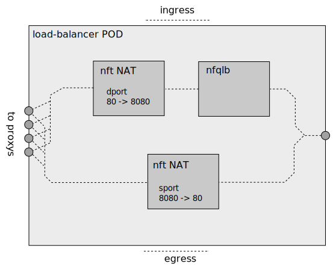

# Meridio - Stateless port-NAT

Stateless port-NAT can be used to map a privileged port, e.g. 80, to
an unprivileged port in the server, e.g. 8080. Port-NAT is enabled
using the `destination-port-nats` property in conduits.

```yaml
  conduits: |
    items:
    - name: conduit-a
      trench: trench-a
      destination-port-nats:
      - port: 80
        target-port: 8080
        vips:
        - vip1
        - vip2
        protocol: TCP
      - port: 90
        target-port: 9090
        vips:
        - vip1
        - vip2
        protocol: TCP
```


## Constraints

* When `destination-port-nats` is specified in a conduit, the corresponding ports
  in `destination-port-ranges` of any flow that belongs to the conduit must be opened.
  All traffic going through the conduit with the corresponding destination address 
  (VIP) + destination port + protocol will be NATted.

* Overlapping of `destination-port-nats` properties is not allowed.

* Port-NAT is not supported for UDP encapsulated SCTP.


## Details

Port-NAT is performed after load-lalancing;



Port-NAT is implemented by `nft` rules;
```
table inet meridio-nat {
        set 80-8080-TCP-ipv4 {
                type ipv4_addr
                flags interval
              s  elements = { 20.0.0.1 }
        }

        set 80-8080-TCP-ipv6 {
                type ipv6_addr
                flags interval
                elements = { 2000::1 }
        }

        set 90-9090-TCP-ipv4 {
                type ipv4_addr
                flags interval
                elements = { 20.0.0.1 }
        }

        set 90-9090-TCP-ipv6 {
                type ipv6_addr
                flags interval
                elements = { 2000::1 }
        }

        chain 80-8080-TCP {
                type filter hook prerouting priority 100; policy accept;
                ip daddr @80-8080-TCP-ipv4 tcp dport 80 tcp dport set 8080 counter packets 0 bytes 0 notrack
                ip saddr @80-8080-TCP-ipv4 tcp sport 8080 tcp sport set 80 counter packets 0 bytes 0 notrack
                ip6 daddr @80-8080-TCP-ipv6 tcp dport 80 tcp dport set 8080 counter packets 0 bytes 0 notrack
                ip6 saddr @80-8080-TCP-ipv6 tcp sport 8080 tcp sport set 80 counter packets 0 bytes 0 notrack
        }

        chain 90-9090-TCP {
                type filter hook prerouting priority 100; policy accept;
                ip daddr @90-9090-TCP-ipv4 tcp dport 90 tcp dport set 9090 counter packets 1010 bytes 54136 notrack
                ip saddr @90-9090-TCP-ipv4 tcp sport 9090 tcp sport set 90 counter packets 579 bytes 36477 notrack
                ip6 daddr @90-9090-TCP-ipv6 tcp dport 90 tcp dport set 9090 counter packets 0 bytes 0 notrack
                ip6 saddr @90-9090-TCP-ipv6 tcp sport 9090 tcp sport set 90 counter packets 0 bytes 0 notrack
        }
}
```

The `100` priority (ChainPriorityNATSource) ensures that NAT comes
after load-balancing.
