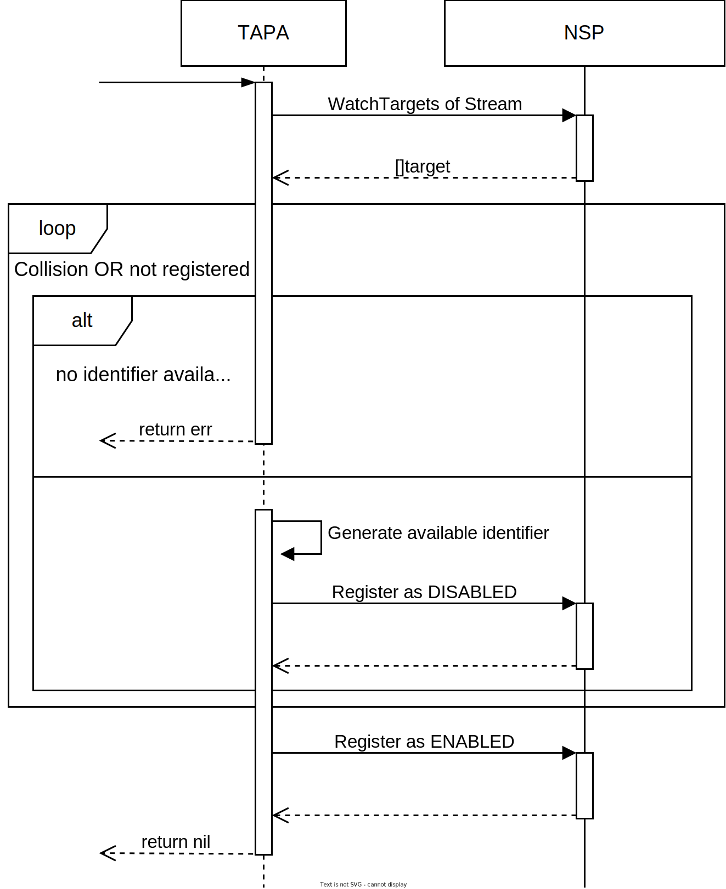
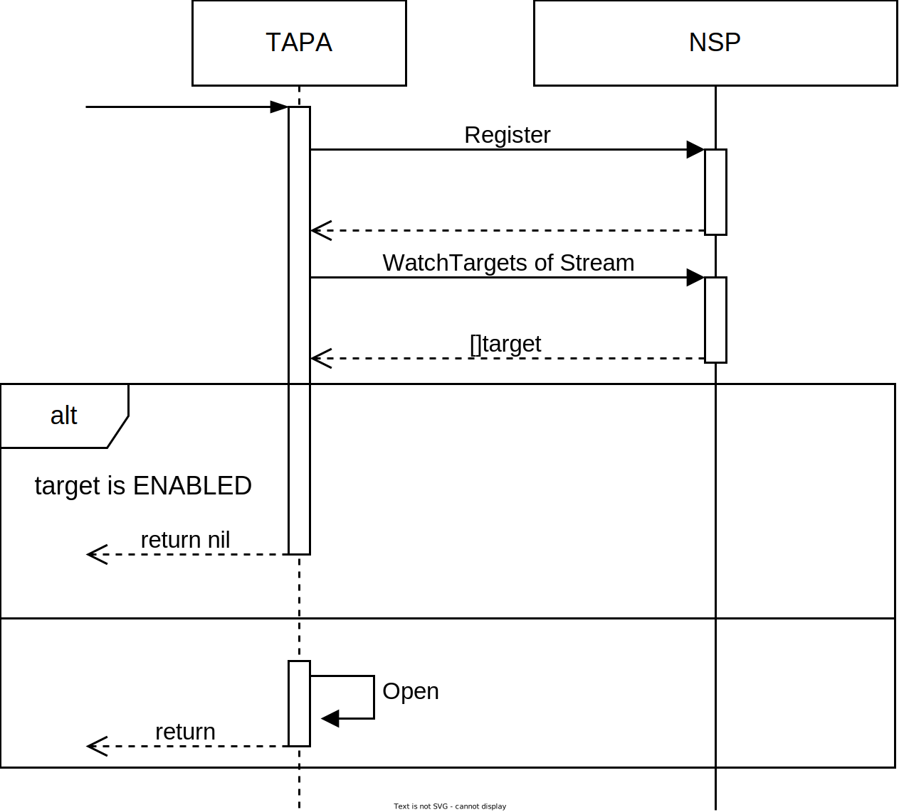

# Target Access Point Ambassador (TAPA)

* [cmd](https://github.com/Nordix/Meridio/tree/master/cmd/tapa)
* [Dockerfile](https://github.com/Nordix/Meridio/tree/master/build/tapa)

## Description

The Target Access Point Ambassador (TAPA) is the main interface user applications can use to interact with Meridio. The TAPA is a local service running in the user pod as a side-car container. User applications can connect to the TAPA server via a unix socket file shared via a volume. Once connected to the server, user applications can consume the TAPA API via three different function: Open/Close/Watch. The proto file of the TAPA can be found [here](https://github.com/Nordix/Meridio/blob/master/api/ambassador/v1/tap.proto).

The watch function allows user applications to monitor the streams opened on the pod and check their status. 

### Open/Close handling

The open process takes place in 3 steps:
1. Connect to the trench if not already connected.
2. Connect to the conduit if not already connected.
3. Register to target registry if not already registered.

While a conduit is opened, the TAPA will monitor the VIP addresses in the trench via the NSP and update the connection to NSM by including the VIPs addresses in the IP Context. Thus, NSM will update the connection and add/remove IP addresses from the conduit target network interface.

The close process takes place in 3 steps:
1. Unregister itself from the NSP Target registry.
2. Close the conduit if no more stream opened in the conduit.
3. Disconnect from the trench (disconnect from NSP) if no more conduit opened.
If for some reason 

The only error the TAPA can return is to indicate to the client that the pod is already connected to another trench. Indeed, a pod cannot be connected to more than one trench at a time.

#### Registration

TODO

#### Refresh

While a stream is opened, the TAPA has to refresh its registration to the target registry to not be considered as a "ghost" entry and then to not be removed automatically.

To achieve the refresh, the TAPA will update its target with the same properties by calling the Register function regularly. After the call, the TAPA will check if the target is still in the `ENABLED` status for the target registry. If not, it means the target registry has previously removed the target and consider the last register call as a new entry, so it has overwritten the status to `DISABLED`. The TAPA will then start the registeration process a new time to register itself with a unique identifier.

## Configuration 

https://github.com/Nordix/Meridio/blob/master/cmd/tapa/config.go

Environment variable | Type | Description | Default
--- | --- | --- | ---
MERIDIO_NAME | string | Name of the pod | nsc
MERIDIO_NODE | string | Node name the target is running on | 
MERIDIO_NAMESPACE | string | Namespace the trenches to connect to are running on | default
MERIDIO_SOCKET | string | Path of the socket file of the TAPA | /ambassador.sock
MERIDIO_NSM_SOCKET | url.URL | Path of the socket file of NSM | unix:///var/lib/networkservicemesh/nsm.io.sock
MERIDIO_NSP_SERVICE_NAME | string | Domain name of the NSP Service | nsp-service
MERIDIO_NSP_SERVICE_PORT | int | port of the NSP Service | 7778
MERIDIO_TIMEOUT | time.Duration | timeout of NSM request/close, NSP register/unregister... | 15s
MERIDIO_DIAL_TIMEOUT | time.Duration | timeout to dial NSMgr | 5s
MERIDIO_MAX_TOKEN_LIFETIME | time.Duration | maximum lifetime of tokens | 24h
MERIDIO_LOG_LEVEL | string | Log level | DEBUG
MERIDIO_NSP_ETRY_TIMEOUT | time.Duration | Timeout of the entries registered in NSP | 30s
MERIDO_GRPC_MAX_BACKOFF | time.Duration | Upper bound on gRPC connection backoff delay | 5s
MERIDIO_GRPC_PROBE_RPC_TIMEOUT | time.Duration | RPC timeout of internal gRPC health probes if any | 1s

## Command Line 

Command | Action | Default
--- | --- | ---
--help | Display a help describing |
--version | Display the version |

## Communication 

Here are all components the tapa is communicating with:

Component | Secured | Method | Description 
--- | --- | --- | ---
Spire | TBD | Unix Socket | Obtain and validate SVIDs
NSM | yes (mTLS) | Unix Socket | Request/Close/Watch connections
NSP Service | yes (mTLS) | TCP | Watch configuration. Register/Unregister targets
User Application | no | Unix Socket | Provide TAPA service

An overview of the communications between all components is available [here](resources.md).

## Health check

The health check is provided by the [GRPC Health Checking Protocol](https://github.com/grpc/grpc/blob/master/doc/health-checking.md). The status returned can be `UNKNOWN`, `SERVING`, `NOT_SERVING` or `SERVICE_UNKNOWN`.

Service | Description
--- | ---
Liveness | A unique service to be used by liveness probe to return status, can aggregate other lesser services
Startup | A unique service to be used by startup probe to return status, can aggregate other lesser services
Readiness | A unique service to be used by readiness probe to return status, can aggregate other lesser services

Service | Probe | Description
--- | --- | ---
AmbassadorSvc | Liveness | Monitor status of the Ambassador server

## Privileges

No privileges required.
