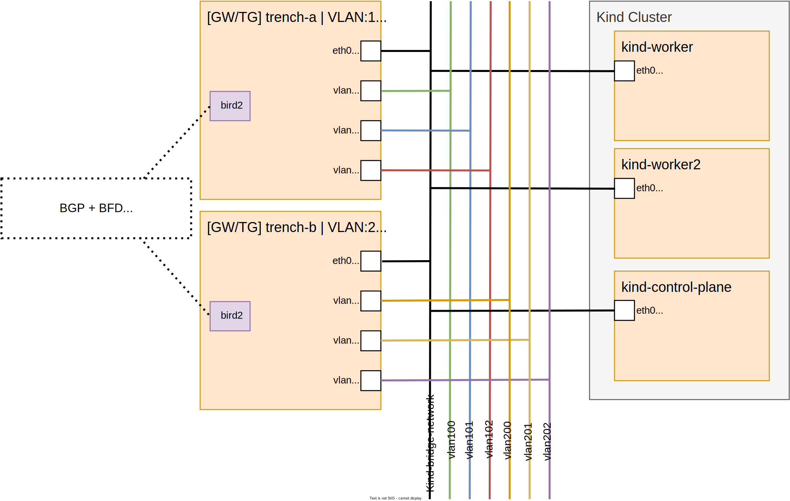

# Environment

## Kind

The primary Kubernetes network works on the `kind-bridge-network`. The workers and TG/GW are connected to that network with their interface `eth0`.

The gateways (GW) / traffic generators (TG) are running as container and are attached to the same network as the containers used for the Kind cluster. They contains `bird2` as routing suite, and `mconnect` and `ctraffic` as traffic generator program. Bird is configured to work with any source and destination IP of any IP family on any interface, with `10179` as source and destination port, `4248829953` as local ASN and `8103` as remote ASN.
2 TG/GW are created:
* `trench-a`: has 3 vlan interfaces (IDs: 100, 101, 102) based on eth0
* `trench-b`: has 3 vlan interfaces (IDs: 200, 201, 202) based on eth0

